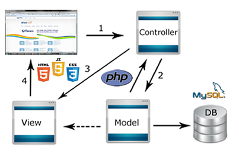

# Getick-deps
  Getick - Ta procurando pra onde ir hoje?  A gente te mostra.
  
##Arquitetura
###Diagrama

##Tecnologias

* PHP - Versão 5.9.6 - Linguagem utilizada para o desenvolvimento do projeto.
* MySQL - Versão 5.7 - Banco utilizado no projeto.
* Trello - Gerenciador das tarefas da equipe.
* GitHub - Gerenciador de versões do projeto.

##Links
###Php
* http://php.net/

###MySQL
* https://www.mysql.com/

###Trello
* https://trello.com/

###GitHub
* https://github.com/
* http://git-scm.com/

