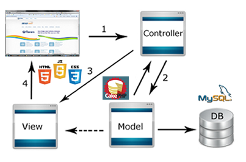

#Getick-deps

Getick - Ta procurando pra onde ir hoje?  A gente te mostra.
  
##Descrição

A Getick é a sua conexão com os melhores eventos. Aqui você fica por dentro do que está rolando e garante seu ticket. 

##Arquitetura
###Diagrama

##Tecnologias

* PHP - Versão 5.9.6 - Linguagem utilizada para o desenvolvimento do projeto.
* CakePHP - Versão 3.0.5 - Framework em PHP para desenvolvimento ágil.
* MySQL - Versão 5.7 - Banco utilizado no projeto.
* Trello - Gerenciador das tarefas da equipe.
* GitHub - Gerenciador de versões do projeto.

##Links

###HTML
* http://www.w3schools.com/html/default.asp

###CSS
* http://www.w3schools.com/css/default.asp

###JavaScript
* http://www.w3schools.com/js/default.asp

###Php
* http://php.net/

###CakePHP
* http://cakephp.org/

###MySQL
* https://www.mysql.com/

###Trello
* https://trello.com/

###GitHub
* https://github.com/
* http://git-scm.com/

